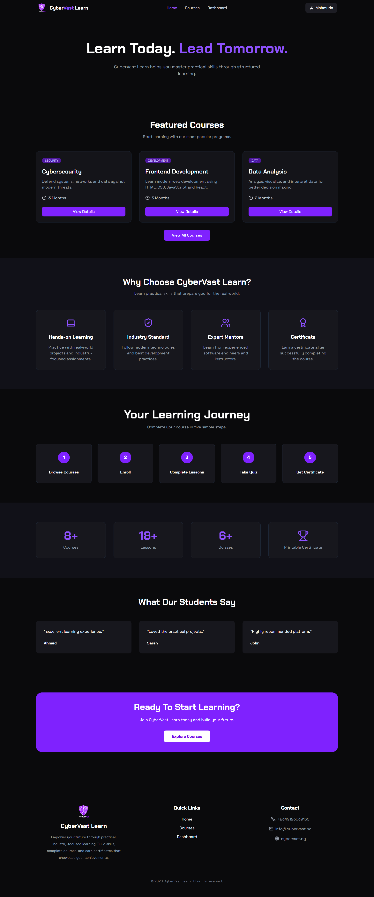
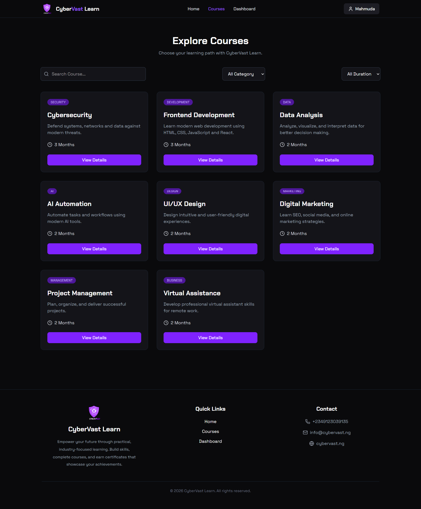
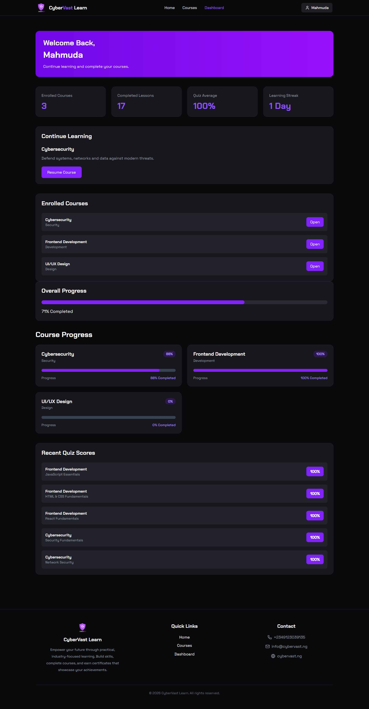

live url:
https://cybervast-learn.vercel.app/


#  CyberVast Learn

A modern Learning Management System (LMS) built with **React.js** for the CyberVast Frontend Development Internship.


## 🌐 Live Demo

https://cybervast-learn.vercel.app/


##  GitHub Repository

https://github.com/mahmudanasrin078/cybervast-learn

##  Project Overview

CyberVast Learn is a responsive Learning Management System where learners can:

- Browse available courses
- Enroll in courses
- Complete lessons
- Take quizzes
- Track learning progress
- Unlock certificates
- Save lesson notes automatically
- Continue learning after reload

All learner data is stored in LocalStorage.

#  Features

##  Learner

- First visit learner name modal
- Persistent learner name
- Reset progress support

##  Courses

- Course catalog from JSON
- Search courses
- Category filters
- Duration filter
- Responsive course cards

##  Course Details

- Course information
- Learning outcomes
- Instructor section
- Enrollment system
- Continue Learning button

##  Lesson Player

- Lesson navigation
- Previous / Next lesson
- Mark lesson as complete
- Resources tab
- Notes tab
- Notes autosave
- Lesson completion persistence


##  Quiz System

- One question at a time
- Previous / Next navigation
- Answer memory
- Score calculation
- Pass mark 80%
- Unlimited retry
- Best score storage

##  Dashboard

- Welcome card
- Continue learning
- Enrolled courses
- Overall progress
- Course progress
- Quiz average
- Recent quiz scores
- Learning streak

##  Certificate

- Certificate unlock
- Learner name
- Course name
- Completion date
- Quiz score
- Printable certificate

##  LocalStorage

The application stores:

- Learner Name
- Enrollments
- Lesson Progress
- Quiz Scores
- Lesson Notes
- Learning Streak

#  Responsive Design

Optimized for

- Mobile
- Tablet
- Laptop
- Desktop

#  Tech Stack

## Frontend

- React.js
- React Router
- Tailwind CSS

## State Management

- React Context API

## Notifications

- React Hot Toast

## Storage

- LocalStorage

## Deployment

- Vercel

#  Folder Structure

```
src/

├── components/
│ ├── common/
│ ├── dashboard/
│ ├── Lesson/
│ └── home/
│
├── context/
│
├── data/
│ └── courses.json
│
├── pages/
│
├── storage/
│
├── layouts/
│
└── routes/
```

#  Installation

Clone the repository

```bash
git clone https://github.com/mahmudanasrin078/cybervast-learn.git
```

Go to project

```bash
cd cybervast-learn
```

Install packages

```bash
npm install
```

Start development server

```bash
npm run dev
```

Build project

```bash
npm run build
```

Preview production build

```bash
npm run preview
```


#  Project Requirements Completed

## MUST

- ✅ FR-01
- ✅ FR-02
- ✅ FR-03
- ✅ FR-04
- ✅ FR-05
- ✅ FR-06
- ✅ FR-07
- ✅ FR-08
- ✅ FR-09
- ✅ FR-10
- ✅ FR-11
- ✅ FR-12

## SHOULD

- ✅ FR-13 Lesson Notes Autosave
- ✅ FR-14 Learning Streak
- ✅ FR-15 Skeleton Loader


#  Developer

**Mahmuda Nasrin**

Frontend Developer

GitHub

https://github.com/mahmudanasrin078

Portfolio

https://mahmuda-nasrin-profile.netlify.app/


#  License

This project was developed for the CyberVast Frontend Development Internship and is intended for educational purposes.

# 📸 Screenshots

## Home



## Courses



## Dashboard


